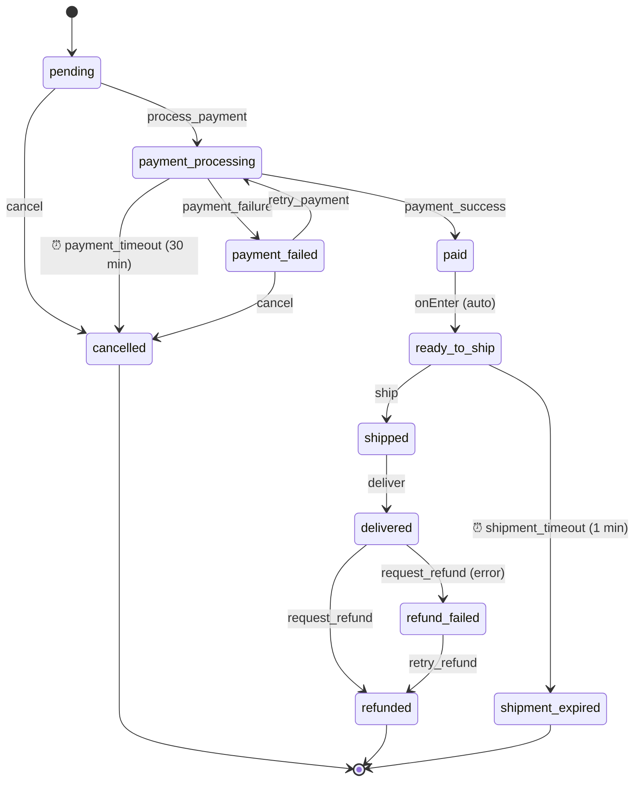

# Duraflows NestJS Examples

Example NestJS application demonstrating [duraflows](https://github.com/camcima/duraflows) with an ecommerce order workflow.

## Ecommerce Order Workflow



### States

| State | Description |
|-------|-------------|
| `pending` | Order created, awaiting payment |
| `payment_processing` | Payment in progress (30-min timeout) |
| `paid` | Payment confirmed (auto-transitions to `ready_to_ship`) |
| `ready_to_ship` | Inventory allocated, awaiting shipment (1-min timeout) |
| `shipped` | Order shipped |
| `delivered` | Order delivered |
| `cancelled` | Order cancelled (terminal) |
| `payment_failed` | Payment failed, can retry or cancel |
| `shipment_expired` | Shipment not fulfilled in time (terminal, demonstrates timeout) |
| `refund_failed` | Refund rejected, can retry (demonstrates `errorState`) |
| `refunded` | Order refunded (terminal) |

The `paid` → `ready_to_ship` transition is automatic via `onEnter` and runs the `allocate-inventory` command. This demonstrates duraflows' auto-transition feature.

### Path Documentation

Each workflow path is documented with sequence diagrams and state diagrams:

- [Happy Path](docs/happy-path.md) -- Full order lifecycle from creation to delivery
- [Refund Failure Path](docs/refund-failure-path.md) -- Error state and retry with `errorState`
- [Shipment Timeout Path](docs/shipment-timeout-path.md) -- Automatic timeout expiration

## Prerequisites

- Node.js 20+
- PostgreSQL 13+ running locally
- `jq` (for pretty-printing script output)

## Setup

1. Clone this repository:

```bash
git clone <repo-url>
cd duraflows-nestjs-examples
```

2. Copy `.env.example` to `.env` and adjust if needed:

```bash
cp .env.example .env
```

Default values assume a local PostgreSQL at `localhost:5432` with user/password `postgres/postgres`.

3. Install dependencies:

```bash
npm install
```

4. Build the project:

```bash
npm run build
```

5. Create the database and tables:

```bash
./scripts/db/create-tables.sh
```

6. Start the server:

```bash
npm start
```

The app will also auto-create the database and tables on startup, but running the script explicitly lets you verify the database setup before starting the server.

## Test Scripts

Scripts are organized in the `scripts/` directory and use `curl` + `jq` against the running server. Set `BASE_URL` to override the default `http://localhost:3000`.

```
scripts/
├── create-order.sh              # Create a new order
├── db/                          # Database utilities
│   ├── create-tables.sh
│   └── truncate-tables.sh
├── events/                      # Trigger individual workflow events
│   ├── process-payment.sh
│   ├── complete-payment.sh
│   ├── fail-payment.sh
│   ├── ship-order.sh
│   ├── deliver-order.sh
│   ├── cancel-order.sh
│   ├── request-refund.sh
│   ├── request-refund-fail.sh
│   └── retry-refund.sh
├── paths/                       # End-to-end workflow paths
│   ├── happy-path.sh
│   ├── refund-failure-path.sh
│   └── shipment-timeout-path.sh
└── queries/                     # Read-only queries
    ├── get-order.sh
    ├── get-events.sh
    ├── get-history.sh
    └── process-timeouts.sh
```

### End-to-End Paths (`scripts/paths/`)

**Happy path** — full order lifecycle (create -> pay -> ship -> deliver):
```bash
./scripts/paths/happy-path.sh
```

**Refund failure path** — exercises the `errorState` feature (refund fails, then retries successfully):
```bash
./scripts/paths/refund-failure-path.sh
```

**Shipment timeout path** — exercises the timeout feature (waits ~70s for the 1-minute timeout to expire):
```bash
./scripts/paths/shipment-timeout-path.sh
```

### Create Order

```bash
./scripts/create-order.sh
# Returns the order UUID
```

### Event Scripts (`scripts/events/`)

All event scripts take an order UUID as an argument:

| Script | Transition |
|--------|------------|
| `process-payment.sh <uuid>` | pending -> payment_processing |
| `complete-payment.sh <uuid>` | payment_processing -> paid -> ready_to_ship |
| `fail-payment.sh <uuid>` | payment_processing -> payment_failed |
| `ship-order.sh <uuid>` | ready_to_ship -> shipped |
| `deliver-order.sh <uuid>` | shipped -> delivered |
| `cancel-order.sh <uuid>` | pending or payment_failed -> cancelled |
| `request-refund.sh <uuid>` | delivered -> refunded |
| `request-refund-fail.sh <uuid>` | delivered -> refund_failed |
| `retry-refund.sh <uuid>` | refund_failed -> refunded |

### Query Scripts (`scripts/queries/`)

| Script | Description |
|--------|-------------|
| `get-order.sh <uuid>` | Get order state |
| `get-events.sh <uuid>` | List available events |
| `get-history.sh <uuid>` | Get transition history |
| `process-timeouts.sh` | Process expired timeouts (payment_processing 30-min, ready_to_ship 1-min) |

### Database Scripts (`scripts/db/`)

| Script | Description |
|--------|-------------|
| `create-tables.sh` | Create the database and tables (idempotent) |
| `truncate-tables.sh` | Truncate all workflow tables (useful for resetting between test runs) |

## REST API

The app exposes the following endpoints (provided by `@camcima/duraflows-nestjs` controllers):

| Method | Endpoint | Description |
|--------|----------|-------------|
| `POST` | `/workflows` | Create a workflow instance |
| `GET` | `/workflows/:uuid` | Get instance by UUID |
| `POST` | `/workflows/:uuid/events/:eventName` | Trigger an event |
| `GET` | `/workflows/:uuid/events` | List available events |
| `GET` | `/workflows/:uuid/history` | Get transition history |
| `POST` | `/workflows/timeouts/process` | Process expired timeouts |

## Environment Variables

| Variable | Default | Description |
|----------|---------|-------------|
| `DATABASE_HOST` | `localhost` | PostgreSQL host |
| `DATABASE_PORT` | `5432` | PostgreSQL port |
| `DATABASE_USER` | `postgres` | PostgreSQL user |
| `DATABASE_PASSWORD` | `postgres` | PostgreSQL password |
| `DATABASE_NAME` | `duraflows_examples` | Database name |
| `PORT` | `3000` | HTTP server port |
