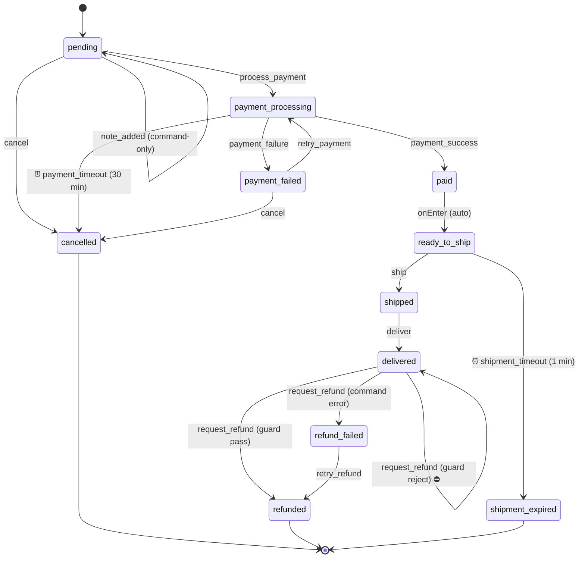

# Duraflows NestJS Examples

Example NestJS application demonstrating [duraflows](https://github.com/camcima/duraflows) **v5.0.0** with an ecommerce order workflow.

This example covers every major v1.0.0, v1.1.0, and v5.0.0 feature:

- **Definition versions** (`WorkflowDefinition.version`, immutable `workflow_definitions` snapshots, `definitionVersion` stamps on instances/history, and the startup guard that fails the app if content drifts under an unbumped version) — see [docs/definition-versions.md](docs/definition-versions.md) (v5.0.0)
- **Two workflow versions side by side** — a second definition (`ecommerce-order-v2`, a fraud-review fork of `ecommerce-order`) registered under a different name and run concurrently, since 5.0.0 has no same-name version pinning yet — see [docs/side-by-side-versions.md](docs/side-by-side-versions.md) (v5.0.0)
- **Event guards** — `WorkflowGuard` + `outcome: "guard-rejected"` — see [docs/guards.md](docs/guards.md) (v1.1.0)
- **State-entry observers** (`WorkflowObserver` + `StateEnterEvent`) — see [docs/observers.md](docs/observers.md)
- **Best-effort commands** (`bestEffort: true`) — see [docs/best-effort-notifications.md](docs/best-effort-notifications.md)
- **Per-command metadata** (`WorkflowExecutionContext.commandMetadata`) — used by `send-notification` to pick `channel` + `template`
- **Command-only events** (events with no `targetState`) — see [docs/command-only-events.md](docs/command-only-events.md)
- **Context transition fields** (`fromState`, `toState`, `transitionUuid`) — used by both the audit observer and the notification command
- **Structured observer-error logging** (`onObserverError`) — wired to NestJS `Logger` in `order.module.ts`
- **Generic `forRootAsync<TArgs>`** — `OrderModule` declares `forRootAsync<[pg.Pool, OrderAuditObserver, RefundWindowGuard]>` so factory params are typechecked against `inject`

## Ecommerce Order Workflow


```mermaid
stateDiagram-v2
    [*] --> pending
    pending --> payment_processing : process_payment
    pending --> cancelled : cancel
    pending --> pending : note_added (command-only)

    payment_processing --> paid : payment_success
    payment_processing --> payment_failed : payment_failure
    payment_processing --> cancelled : ⏰ payment_timeout (30 min)

    paid --> ready_to_ship : onEnter (auto)

    ready_to_ship --> shipped : ship
    ready_to_ship --> shipment_expired : ⏰ shipment_timeout (1 min)

    shipped --> delivered : deliver

    delivered --> refunded : request_refund (guard pass)
    delivered --> delivered : request_refund (guard reject) ⛔
    delivered --> refund_failed : request_refund (command error)

    payment_failed --> payment_processing : retry_payment
    payment_failed --> cancelled : cancel

    refund_failed --> refunded : retry_refund

    cancelled --> [*]
    refunded --> [*]
    shipment_expired --> [*]
```

### States

| State | Description |
|-------|-------------|
| `pending` | Order created, awaiting payment |
| `payment_processing` | Payment in progress (30-min timeout) |
| `paid` | Payment confirmed (auto-transitions to `ready_to_ship`) |
| `ready_to_ship` | Inventory allocated, awaiting shipment (1-min timeout) |
| `shipped` | Order shipped |
| `delivered` | Order delivered |
| `cancelled` | Order cancelled (terminal) |
| `payment_failed` | Payment failed, can retry or cancel |
| `shipment_expired` | Shipment not fulfilled in time (terminal, demonstrates timeout) |
| `refund_failed` | Refund rejected, can retry (demonstrates `errorState`) |
| `refunded` | Order refunded (terminal) |

The `paid` → `ready_to_ship` transition is automatic via `onEnter` and runs `allocate-inventory` followed by a `bestEffort` `send-notification`. The `note_added` event in `pending` runs `add-note` without changing state — both patterns are new in v1.0.0.

### Path Documentation

Each workflow path is documented with sequence diagrams and state diagrams:

- [Happy Path](docs/happy-path.md) -- Full order lifecycle from creation to delivery
- [Refund Failure Path](docs/refund-failure-path.md) -- Error state and retry with `errorState`
- [Shipment Timeout Path](docs/shipment-timeout-path.md) -- Automatic timeout expiration
- [Best-Effort Commands](docs/best-effort-notifications.md) -- v1.0.0 `bestEffort: true` for fire-and-forget side effects
- [Command-Only Events](docs/command-only-events.md) -- v1.0.0 events with no `targetState`
- [Observers](docs/observers.md) -- v1.0.0 `WorkflowObserver` post-commit lifecycle hooks
- [Event Guards](docs/guards.md) -- v1.1.0 per-event preconditions with `outcome: "guard-rejected"`
- [WorkflowHandle](docs/workflow-handle.md) -- Programmatic usage with the thin-proxy handle pattern
- [Definition Versions](docs/definition-versions.md) -- v5.0.0 explicit `version`, snapshot table, startup guard, and why resolution is unchanged (no pinning yet)
- [Side-by-Side Versions](docs/side-by-side-versions.md) -- v5.0.0 running two workflow names concurrently as a workaround for not-yet-built version pinning, its costs, and when to use a `version` bump instead

## Prerequisites

- Node.js 20+
- PostgreSQL 13+ running locally
- `jq` (for pretty-printing script output)

## Setup

1. Clone this repository:

```bash
git clone <repo-url>
cd duraflows-nestjs-examples
```

2. Copy `.env.example` to `.env` and adjust if needed:

```bash
cp .env.example .env
```

Default values assume a local PostgreSQL at `localhost:5432` with user/password `postgres/postgres`.

3. Install dependencies:

```bash
npm install
```

4. Build the project:

```bash
npm run build
```

5. Create the database and tables:

```bash
./scripts/db/create-tables.sh
```

6. Start the server:

```bash
npm start
```

The app will also auto-create the database and tables on startup, but running the script explicitly lets you verify the database setup before starting the server.

## Test Scripts

Scripts are organized in the `scripts/` directory and use `curl` + `jq` against the running server. Set `BASE_URL` to override the default `http://localhost:3000`.

```
scripts/
├── create-order.sh              # Create a new order (ecommerce-order)
├── create-order-v2.sh           # Create a new order-v2 order (ecommerce-order-v2, v5.0.0 side-by-side)
├── db/                          # Database utilities
│   ├── create-tables.sh
│   └── truncate-tables.sh
├── events/                      # Trigger individual workflow events
│   ├── process-payment.sh
│   ├── complete-payment.sh
│   ├── complete-payment-fraud-flag.sh   # ecommerce-order-v2 only: forces the fraud_hold branch (v5.0.0)
│   ├── fail-payment.sh
│   ├── ship-order.sh
│   ├── deliver-order.sh
│   ├── cancel-order.sh
│   ├── request-refund.sh
│   ├── request-refund-fail.sh
│   ├── retry-refund.sh
│   ├── add-note.sh              # Command-only event (v1.0.0)
│   ├── approve-hold.sh          # ecommerce-order-v2 only: clears a fraud_hold (v5.0.0)
│   └── reject-hold.sh           # ecommerce-order-v2 only: cancels from fraud_hold (v5.0.0)
├── paths/                       # End-to-end workflow paths
│   ├── happy-path.sh
│   ├── refund-failure-path.sh
│   ├── shipment-timeout-path.sh
│   ├── best-effort-notification-path.sh   # bestEffort failure (v1.0.0)
│   ├── refund-window-pass-path.sh         # guard PASSES (v1.1.0)
│   └── refund-window-rejected-path.sh     # guard REJECTS (v1.1.0)
└── queries/                     # Read-only queries
    ├── get-order.sh
    ├── get-events.sh
    ├── get-history.sh
    ├── process-timeouts.sh
    ├── list-definition-snapshots.sh     # workflow_definitions rows (v5.0.0)
    ├── get-definition-versions.sh       # instance + history definitionVersion stamps (v5.0.0)
    └── list-instances-by-workflow.sh    # instances across both workflow names side by side (v5.0.0)
```

### End-to-End Paths (`scripts/paths/`)

**Happy path** — full order lifecycle (create -> pay -> ship -> deliver):
```bash
./scripts/paths/happy-path.sh
```

**Refund failure path** — exercises the `errorState` feature (refund fails, then retries successfully):
```bash
./scripts/paths/refund-failure-path.sh
```

**Shipment timeout path** — exercises the timeout feature (waits ~70s for the 1-minute timeout to expire):
```bash
./scripts/paths/shipment-timeout-path.sh
```

**Best-effort notification path (v1.0.0)** — proves the workflow still reaches `delivered` even when the bestEffort `send-notification` command throws:
```bash
./scripts/paths/best-effort-notification-path.sh
```

**Refund window guard — PASS (v1.1.0)** — the `request_refund` event's guard returns `true` for an order delivered moments ago, the refund proceeds, the order reaches `refunded`:
```bash
./scripts/paths/refund-window-pass-path.sh
```

**Refund window guard — REJECT (v1.1.0)** — the same event's guard returns `false` for an order whose `deliveredAt` is backdated 60 days; the response carries `outcome: "guard-rejected"` and `rejectedBy: "refund-window"`, no commands run, no state change, and a guard-rejected history row is appended:
```bash
./scripts/paths/refund-window-rejected-path.sh
```

### Create Order

```bash
./scripts/create-order.sh
# Returns the order UUID
```

**Side-by-side (v5.0.0)** — create an order on the second, independently-registered `ecommerce-order-v2` definition instead:

```bash
./scripts/create-order-v2.sh
# Returns the order UUID
```

### Event Scripts (`scripts/events/`)

All event scripts take an order UUID as an argument. Event names are shared between `ecommerce-order` and `ecommerce-order-v2` wherever the flow is identical, so these work against instances of either workflow name unless noted otherwise:

| Script | Transition |
|--------|------------|
| `process-payment.sh <uuid>` | pending -> payment_processing |
| `complete-payment.sh <uuid>` | payment_processing -> paid -> ready_to_ship (`ecommerce-order`) or -> fraud_review -> ready_to_ship (`ecommerce-order-v2`, clean screen) |
| `complete-payment-fraud-flag.sh <uuid>` | `ecommerce-order-v2` only: payment_processing -> paid -> fraud_review -> fraud_hold (v5.0.0) |
| `fail-payment.sh <uuid>` | payment_processing -> payment_failed |
| `ship-order.sh <uuid>` | ready_to_ship -> shipped |
| `deliver-order.sh <uuid>` | shipped -> delivered |
| `cancel-order.sh <uuid>` | pending or payment_failed -> cancelled |
| `request-refund.sh <uuid>` | delivered -> refunded |
| `request-refund-fail.sh <uuid>` | delivered -> refund_failed |
| `retry-refund.sh <uuid>` | refund_failed -> refunded |
| `add-note.sh <uuid> [note]` | pending -> pending (command-only event, v1.0.0) |
| `approve-hold.sh <uuid>` | `ecommerce-order-v2` only: fraud_hold -> ready_to_ship (v5.0.0) |
| `reject-hold.sh <uuid>` | `ecommerce-order-v2` only: fraud_hold -> cancelled (v5.0.0) |

### Query Scripts (`scripts/queries/`)

| Script | Description |
|--------|-------------|
| `get-order.sh <uuid>` | Get order state |
| `get-events.sh <uuid>` | List available events |
| `get-history.sh <uuid>` | Get transition history |
| `process-timeouts.sh` | Process expired timeouts (payment_processing 30-min, ready_to_ship 1-min) |
| `list-definition-snapshots.sh` | List every `workflow_definitions` snapshot row (v5.0.0, direct `psql` -- no REST equivalent) |
| `get-definition-versions.sh <uuid>` | Show an instance's `definitionVersion` alongside its history rows' versions (v5.0.0) |
| `list-instances-by-workflow.sh [workflow-name]` | List instances across both workflow names side by side, each with its own `definitionVersion` (v5.0.0, direct `psql`) |

### Database Scripts (`scripts/db/`)

| Script | Description |
|--------|-------------|
| `create-tables.sh` | Create the database and tables (idempotent) |
| `truncate-tables.sh` | Truncate all workflow tables (useful for resetting between test runs) |

## REST API

The app exposes the following endpoints (provided by `@camcima/duraflows-nestjs` controllers):

| Method | Endpoint | Description |
|--------|----------|-------------|
| `POST` | `/workflows` | Create a workflow instance |
| `GET` | `/workflows/:uuid` | Get instance by UUID |
| `POST` | `/workflows/:uuid/events/:eventName` | Trigger an event |
| `GET` | `/workflows/:uuid/events` | List available events |
| `GET` | `/workflows/:uuid/history` | Get transition history |
| `POST` | `/workflows/timeouts/process` | Process expired timeouts |

## Environment Variables

| Variable | Default | Description |
|----------|---------|-------------|
| `DATABASE_HOST` | `localhost` | PostgreSQL host |
| `DATABASE_PORT` | `5432` | PostgreSQL port |
| `DATABASE_USER` | `postgres` | PostgreSQL user |
| `DATABASE_PASSWORD` | `postgres` | PostgreSQL password |
| `DATABASE_NAME` | `duraflows_examples` | Database name |
| `PORT` | `3000` | HTTP server port |
