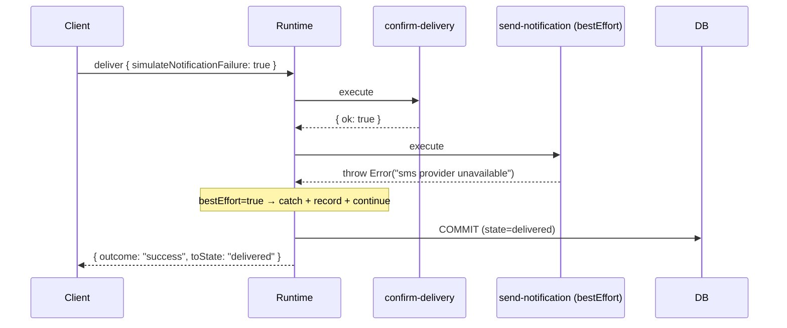

# Best-Effort Commands

duraflows v1.0.0 added an optional `bestEffort: true` flag to the `WorkflowCommand` interface. A best-effort command is fire-and-forget: failure here is recorded in the history record but does **not** stop the chain or taint the aggregate `outcome`.

This example uses bestEffort for notifications — flaky email/SMS providers should never block an order from progressing.

## Failure Semantics — bestEffort vs. mandatory

| Outcome                       | Mandatory command                                                    | `bestEffort: true` command                                                              |
| ----------------------------- | -------------------------------------------------------------------- | --------------------------------------------------------------------------------------- |
| Returns `{ ok: true }`        | Chain continues                                                      | Chain continues                                                                         |
| Returns `{ ok: false }`       | Chain stops. Routes to `errorState` if defined, else throws          | Result recorded; chain continues; aggregate `outcome` stays `success`                   |
| Throws                        | Exception propagates; transaction rolls back                         | Caught and recorded as `{ ok: false, code: "BEST_EFFORT_THROWN", error: { name, message, stack } }`; chain continues |

A best-effort `ok: false` does not contribute to the failure aggregation in `WorkflowExecutionResult.outcome` (v1.0.0 also added `outcome` as an aggregate field on `OnEnterChainResult`).

## This Example

`commands/send-notification.command.ts`:

```ts
@WorkflowCommand("send-notification")
export class SendNotificationCommand implements WorkflowCommandInterface {
  readonly bestEffort = true;

  execute(subject: unknown, context: WorkflowExecutionContext): CommandResult {
    const channel = (context.commandMetadata.channel as string) ?? "email";
    const template = (context.commandMetadata.template as string) ?? "generic";

    if ((subject as { simulateNotificationFailure?: boolean })?.simulateNotificationFailure) {
      throw new Error(`${channel} provider unavailable`);
    }
    return { ok: true, code: "NOTIFICATION_SENT", metadata: { channel, template } };
  }
}
```

It is wired in `order.definition.ts` at two points — the `paid → ready_to_ship` `onEnter` chain, and the `shipped → delivered` event:

```ts
paid: {
  onEnter: {
    targetState: "ready_to_ship",
    commands: [
      { name: "allocate-inventory" },
      { name: "send-notification", metadata: { channel: "email", template: "payment-confirmed" } },
    ],
  },
},
shipped: {
  events: {
    deliver: {
      targetState: "delivered",
      commands: [
        { name: "confirm-delivery" },
        { name: "send-notification", metadata: { channel: "sms", template: "delivered" } },
      ],
    },
  },
},
```

## Per-Command Metadata

The `metadata` field on each `WorkflowCommandRef` is exposed to the handler via `WorkflowExecutionContext.commandMetadata` (also v1.0.0). This lets a single command class serve many call sites with different parameters — channel, template, recipient list, vendor — without subclassing.

`commandMetadata` is deep-cloned and deep-frozen per command, so each ref in a chain sees its own metadata, never a prior command's.

## Running the Demo

```bash
./scripts/paths/best-effort-notification-path.sh
```

The script drives an order through `pending → ... → delivered`, but on the final `deliver` call passes `subject.simulateNotificationFailure: true`. The thrown error is captured, but:

- `currentState` reaches `delivered`
- `outcome` is `"success"`
- The history record's `commandResults` shows the failure with a serializable `{ name, message, stack }` shape



## When NOT to Use bestEffort

bestEffort means "I don't care if this fails." Don't use it for any command whose failure should affect business state — payment capture, inventory adjustment, ledger writes. For those, use a mandatory command and route failure to an `errorState` (see [Refund Failure Path](./refund-failure-path.md)).
