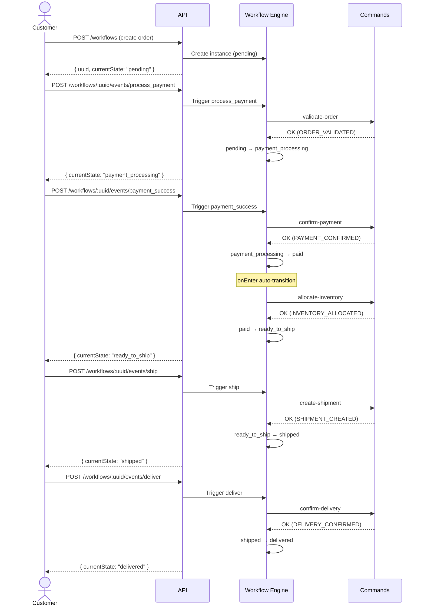
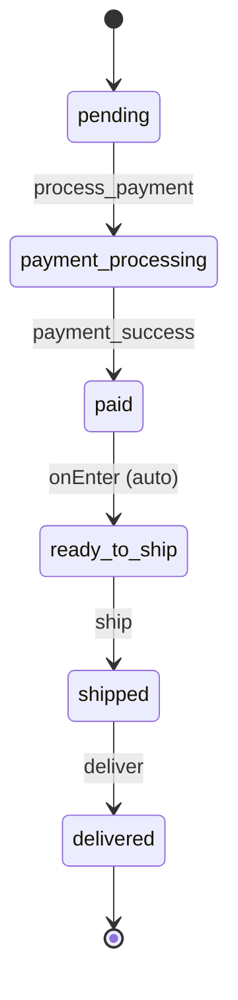

# Happy Path

The happy path represents the ideal order lifecycle: an order is created, paid for, shipped, and delivered.

## Sequence Diagram



## State Diagram



## Steps

| # | Event | Command | From State | To State |
|---|-------|---------|------------|----------|
| 1 | `process_payment` | `validate-order` | pending | payment_processing |
| 2 | `payment_success` | `confirm-payment` | payment_processing | paid |
| 3 | _(auto)_ | `allocate-inventory` | paid | ready_to_ship |
| 4 | `ship` | `create-shipment` | ready_to_ship | shipped |
| 5 | `deliver` | `confirm-delivery` | shipped | delivered |

## Key Concepts Demonstrated

- **Auto-transition (`onEnter`)** -- When the workflow enters the `paid` state, it automatically runs `allocate-inventory` and transitions to `ready_to_ship` without requiring an external event. This is useful for steps that should always execute immediately upon entering a state.
- **Context enrichment** -- Each command adds data to the workflow context (`validatedAt`, `paidAt`, `inventoryAllocatedAt`, `shippedAt`, `trackingNumber`, `deliveredAt`), building up an audit trail as the order progresses.

## Running It

```bash
./scripts/paths/happy-path.sh
```

This script creates an order and drives it through all five transitions, then prints the final state and full transition history.
