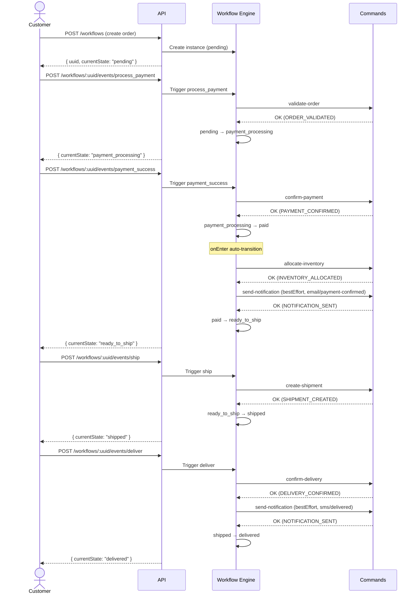
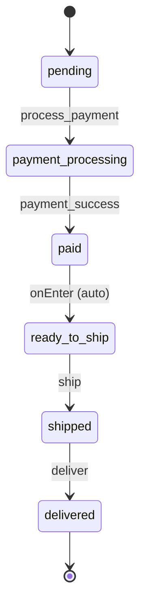

# Happy Path

The happy path represents the ideal order lifecycle: an order is created, paid for, shipped, and delivered.

## Sequence Diagram


```mermaid
sequenceDiagram
    actor Customer
    participant API
    participant Workflow as Workflow Engine
    participant Commands

    Customer->>API: POST /workflows (create order)
    API->>Workflow: Create instance (pending)
    API-->>Customer: { uuid, currentState: "pending" }

    Customer->>API: POST /workflows/:uuid/events/process_payment
    API->>Workflow: Trigger process_payment
    Workflow->>Commands: validate-order
    Commands-->>Workflow: OK (ORDER_VALIDATED)
    Workflow->>Workflow: pending → payment_processing
    API-->>Customer: { currentState: "payment_processing" }

    Customer->>API: POST /workflows/:uuid/events/payment_success
    API->>Workflow: Trigger payment_success
    Workflow->>Commands: confirm-payment
    Commands-->>Workflow: OK (PAYMENT_CONFIRMED)
    Workflow->>Workflow: payment_processing → paid

    Note over Workflow: onEnter auto-transition
    Workflow->>Commands: allocate-inventory
    Commands-->>Workflow: OK (INVENTORY_ALLOCATED)
    Workflow->>Commands: send-notification (bestEffort, email/payment-confirmed)
    Commands-->>Workflow: OK (NOTIFICATION_SENT)
    Workflow->>Workflow: paid → ready_to_ship
    API-->>Customer: { currentState: "ready_to_ship" }

    Customer->>API: POST /workflows/:uuid/events/ship
    API->>Workflow: Trigger ship
    Workflow->>Commands: create-shipment
    Commands-->>Workflow: OK (SHIPMENT_CREATED)
    Workflow->>Workflow: ready_to_ship → shipped
    API-->>Customer: { currentState: "shipped" }

    Customer->>API: POST /workflows/:uuid/events/deliver
    API->>Workflow: Trigger deliver
    Workflow->>Commands: confirm-delivery
    Commands-->>Workflow: OK (DELIVERY_CONFIRMED)
    Workflow->>Commands: send-notification (bestEffort, sms/delivered)
    Commands-->>Workflow: OK (NOTIFICATION_SENT)
    Workflow->>Workflow: shipped → delivered
    API-->>Customer: { currentState: "delivered" }
```

## State Diagram


```mermaid
stateDiagram-v2
    [*] --> pending
    pending --> payment_processing : process_payment
    payment_processing --> paid : payment_success
    paid --> ready_to_ship : onEnter (auto)
    ready_to_ship --> shipped : ship
    shipped --> delivered : deliver
    delivered --> [*]

    state "pending" as pending
    state "payment_processing" as payment_processing
    state "paid" as paid
    state "ready_to_ship" as ready_to_ship
    state "shipped" as shipped
    state "delivered" as delivered
```

## Steps

| # | Event | Command | From State | To State |
|---|-------|---------|------------|----------|
| 1 | `process_payment` | `validate-order` | pending | payment_processing |
| 2 | `payment_success` | `confirm-payment` | payment_processing | paid |
| 3 | _(auto)_ | `allocate-inventory` + `send-notification` (bestEffort) | paid | ready_to_ship |
| 4 | `ship` | `create-shipment` | ready_to_ship | shipped |
| 5 | `deliver` | `confirm-delivery` + `send-notification` (bestEffort) | shipped | delivered |

## Key Concepts Demonstrated

- **Auto-transition (`onEnter`)** -- When the workflow enters the `paid` state, it automatically runs `allocate-inventory`, fires a best-effort `send-notification`, and transitions to `ready_to_ship` without requiring an external event.
- **Context enrichment** -- Each command adds data to the workflow context (`validatedAt`, `paidAt`, `inventoryAllocatedAt`, `shippedAt`, `trackingNumber`, `deliveredAt`), building up an audit trail as the order progresses.
- **Best-effort notifications (v1.0.0)** -- `send-notification` runs as `bestEffort: true` on both auto-transition and delivery. Failures are recorded but do not abort the workflow. See [Best-Effort Commands](./best-effort-notifications.md).
- **State-entry observers (v1.0.0)** -- Every state entry on this path fires `OrderAuditObserver` post-commit. Watch the server log for the audit trail. See [Observers](./observers.md).

## Running It

```bash
./scripts/paths/happy-path.sh
```

This script creates an order and drives it through all five transitions, then prints the final state and full transition history.
