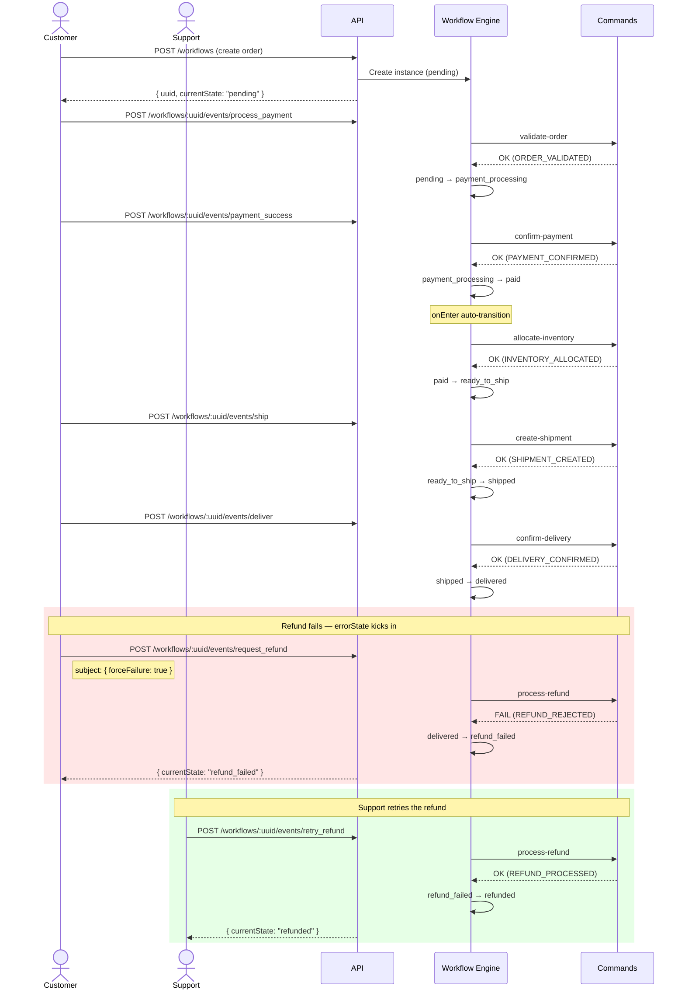
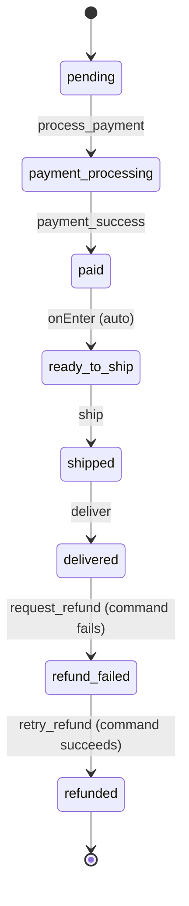

# Refund Failure Path

This path exercises the **error state** feature. After a normal order lifecycle, a refund is requested but fails. The workflow transitions to `refund_failed` instead of `refunded`, and a retry eventually succeeds.

## Sequence Diagram



## State Diagram



## Steps

| # | Event | Command | From State | To State | Outcome |
|---|-------|---------|------------|----------|---------|
| 1 | `process_payment` | `validate-order` | pending | payment_processing | OK |
| 2 | `payment_success` | `confirm-payment` | payment_processing | paid | OK |
| 3 | _(auto)_ | `allocate-inventory` | paid | ready_to_ship | OK |
| 4 | `ship` | `create-shipment` | ready_to_ship | shipped | OK |
| 5 | `deliver` | `confirm-delivery` | shipped | delivered | OK |
| 6 | `request_refund` | `process-refund` | delivered | refund_failed | **FAIL** |
| 7 | `retry_refund` | `process-refund` | refund_failed | refunded | OK |

## Key Concepts Demonstrated

- **Error states (`errorState`)** -- The `request_refund` event defines both a `targetState: "refunded"` and an `errorState: "refund_failed"`. When the `process-refund` command returns `{ ok: false }`, the workflow transitions to the error state instead of the target state.
- **Retry from error state** -- The `refund_failed` state defines a `retry_refund` event that re-executes the same `process-refund` command. If it succeeds, the workflow moves to `refunded`. If it fails again, it stays in `refund_failed`.
- **Subject data** -- The `forceFailure` flag is passed via the event's `subject` field, allowing the command to simulate a payment gateway rejection. This shows how external input can influence command behavior.

## Running It

```bash
./scripts/paths/refund-failure-path.sh
```

This script runs the full order lifecycle, then triggers a failing refund followed by a successful retry.
