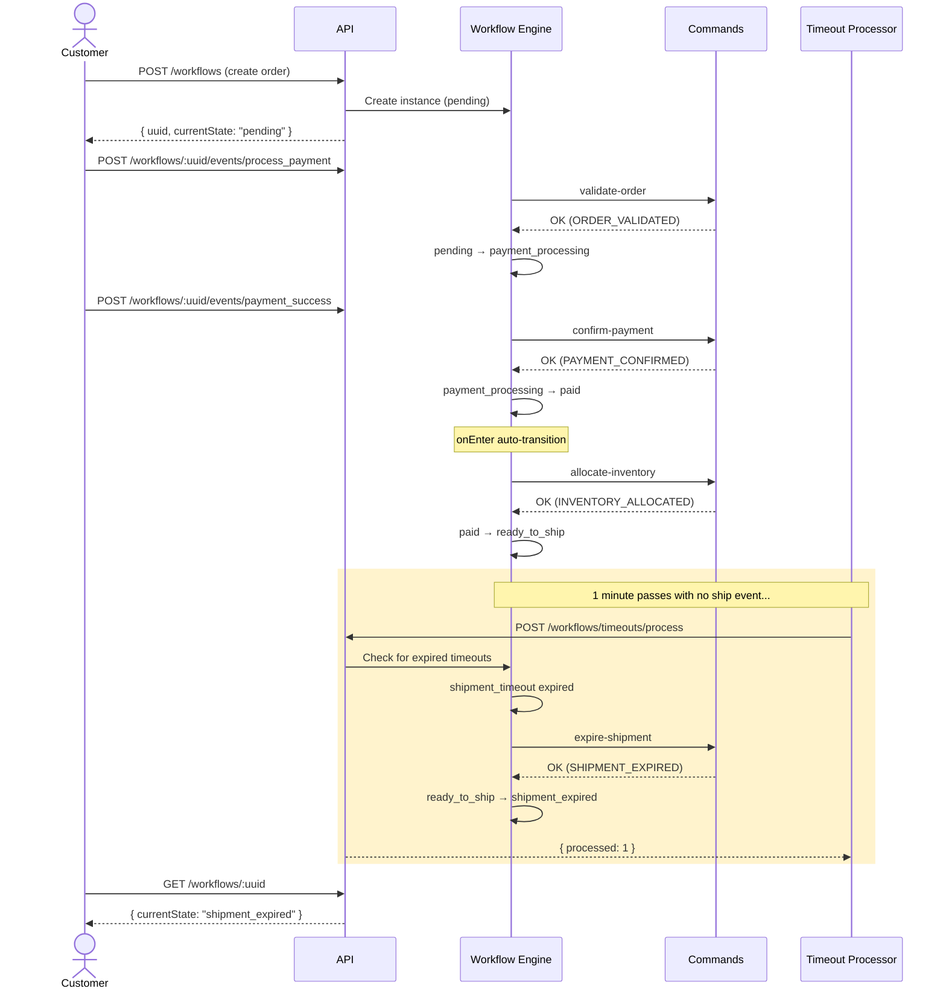
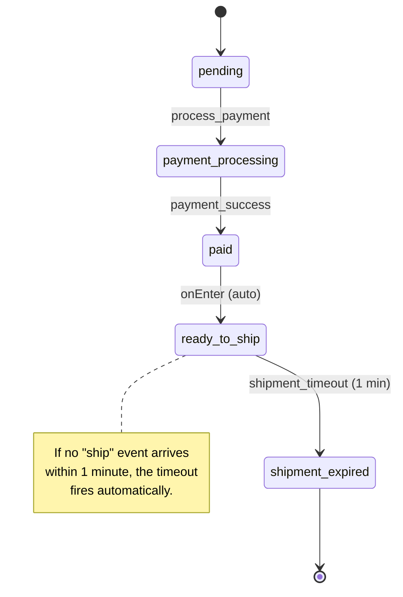

# Shipment Timeout Path

This path exercises the **timeout** feature. After payment succeeds and inventory is allocated, the order sits in `ready_to_ship` until the 1-minute timeout expires, automatically transitioning to `shipment_expired`.

## Sequence Diagram



## State Diagram



## Steps

| # | Event | Command | From State | To State | Notes |
|---|-------|---------|------------|----------|-------|
| 1 | `process_payment` | `validate-order` | pending | payment_processing | |
| 2 | `payment_success` | `confirm-payment` | payment_processing | paid | |
| 3 | _(auto)_ | `allocate-inventory` | paid | ready_to_ship | |
| 4 | _(timeout)_ | `expire-shipment` | ready_to_ship | shipment_expired | After 1 min |

## Key Concepts Demonstrated

- **Timeouts** -- Events can define a `timeout` property (e.g., `{ afterMinutes: 1 }`). When the workflow has been in the state longer than the specified duration, the timeout event becomes eligible for processing.
- **Timeout processing** -- Timeouts are not processed automatically by a background job. Instead, the `POST /workflows/timeouts/process` endpoint must be called (e.g., via a cron job). This gives you full control over when and how timeouts are checked.
- **Multiple timeouts in the workflow** -- This workflow defines two timeouts:
  - `payment_timeout` in `payment_processing` (30 minutes) -- cancels the order if payment takes too long.
  - `shipment_timeout` in `ready_to_ship` (1 minute) -- expires the order if it isn't shipped in time.

  This path demonstrates only the shipment timeout; the payment timeout follows the same mechanism.

## Running It

```bash
./scripts/paths/shipment-timeout-path.sh
```

This script creates an order, processes payment, then waits ~70 seconds before calling the timeout processor. The order should end up in `shipment_expired`.
