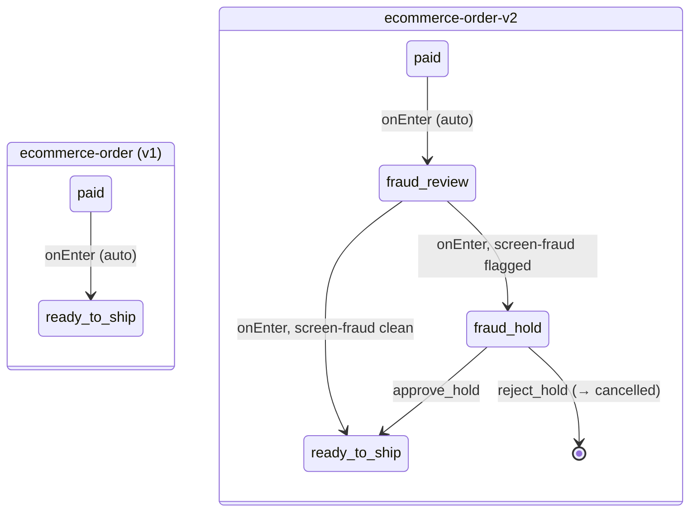

# Running Two Workflow Versions Side by Side (v5.0.0)

This example app also ships `ecommerce-order-v2`, a **second, independent workflow definition** registered alongside `ecommerce-order` in the same `WorkflowModule`. Both are live at the same time; both are reachable through the same REST surface; both have their own rows in `workflow_definitions`.

**Read this first, the same way you'd read the warning at the top of [docs/definition-versions.md](definition-versions.md):** this is **not** duraflows version pinning. There is no such thing as "two versions of the `ecommerce-order` workflow" running concurrently in 5.0.0. What exists here is two workflows with two different **names** — `ecommerce-order` and `ecommerce-order-v2` — that happen to describe closely related processes and happen to share almost all of their command code. If you came here wanting to run an old and a new copy of literally the same workflow name at once, keep reading: this document explains why that isn't possible yet, and what to do instead until it is.

## The Problem

`WorkflowDefinition.version` (v5.0.0, see [docs/definition-versions.md](definition-versions.md)) is provenance, not pinning. Every instance — brand new or already in flight — executes whatever content is **currently registered** under its `workflowName`, full stop. There is no way to say "this instance should keep running the definition it was created under" and no way to say "this instance should move to the new definition." If you edit `order.definition.ts` in place and redeploy, every existing `ecommerce-order` instance starts executing the new logic on its very next transition, whether or not that's what you wanted.

That's fine for backward-compatible changes — see [When *Not* To Do This](#when-not-to-do-this) below. It's a real problem the moment the change is **not** backward-compatible for instances already mid-flight: a state an in-flight instance is currently sitting in gets renamed or removed, an event it's about to fire gets a new mandatory command, a branch gets restructured. Editing the live definition in place means every in-flight instance is retroactively subject to a shape it was never created against.

## The Pattern

Fork the workflow under a **new name**. Register both definitions in the same `WorkflowModule`. Route new work to the new name; let the old name drain as its instances complete naturally.

Concretely, three things happen:

1. **Copy the definition to a new name.** `order-v2.definition.ts` exports `orderV2WorkflowDefinition` with `name: "ecommerce-order-v2"` (`version: 1` — versions are independent per name, they don't need to relate to the original's version number at all).
2. **Register both in the same module.** `order.module.ts`'s `workflows` array becomes `[orderWorkflowDefinition, orderV2WorkflowDefinition]` — one `WorkflowModule.forRootAsync` call, one runtime, one shared command registry, one shared guard registry, two definitions.
3. **Route new work at the call site.** Whatever decides `workflowName` when calling `POST /workflows` — a feature flag, a percentage rollout, an environment variable — points new orders at `ecommerce-order-v2`. Nothing in duraflows does this routing for you; it's ordinary application code, same as picking any other field in a `createInstance` call.

Existing `ecommerce-order` instances never see `ecommerce-order-v2`'s content and vice versa — they're fully independent from the registry's point of view. `ecommerce-order` instances keep running exactly the logic they always have, right up until you stop creating new ones and the last one finishes.

### Why a new name and not a version bump

Two definitions cannot share a name. `InMemoryDefinitionRegistry.register()` throws `WorkflowDefinitionError` on a duplicate `name` — confirmed by temporarily pointing `orderV2WorkflowDefinition` at `name: "ecommerce-order"` and restarting the app:

```
[Nest]   ERROR [ExceptionHandler] WorkflowDefinitionError: Workflow "ecommerce-order": A workflow with this name is already registered
    at InMemoryDefinitionRegistry.register (.../node_modules/@duraflows/core/dist/registry/definition-registry.js:17:19)
    at InstanceWrapper.useFactory [as metatype] (.../node_modules/@duraflows/nestjs/dist/workflow.module.js:109:30)
    ...
```

This is a harder failure than the version-drift guard in [docs/definition-versions.md](definition-versions.md) — it throws synchronously while NestJS is constructing the `WORKFLOW_DEFINITION_REGISTRY` provider, before `WorkflowRuntime.initialize()` (the definition-version content-hash check) ever runs. There is no code path in 5.0.0 where two differently-shaped definitions resolve under one name; the registry rejects the attempt at construction time, every time.

And even if it didn't: resolution is name-only everywhere. `WorkflowRuntime.createInstance`, `triggerEvent`, `getAvailableEvents`, and `processExpiredWorkflows` all call `definitionRegistry.get(workflowName)` with no version argument. There is no hook to say "resolve this instance against the definition content it was created under" — an instance's `definitionVersion` stamp is metadata, not a resolution key. So even a hypothetical registry that tolerated duplicate names would have no way to route an instance to "its" copy. The only axis the runtime resolves on is the name.

## What This Fork Actually Changes

`ecommerce-order-v2` adds a fraud-review gateway between `paid` and `ready_to_ship`: a `fraud_review` state whose `onEnter` runs a new `screen-fraud` command, branching to `ready_to_ship` on a clean screen or to a new `fraud_hold` waiting state (with `approve_hold` / `reject_hold` events) on a flagged one.



Everything else — `pending`, `payment_processing`, `ready_to_ship` onward, `payment_failed`, the refund path — is byte-for-byte identical between the two definitions, in the literal sense that `order-v2.definition.ts` repeats the same `states` blocks rather than importing or extending `order.definition.ts` (`WorkflowDefinition` objects are plain data with no inheritance mechanism; duplication is how you get a second complete, independently editable copy). What's *not* duplicated is the code those states reference: `order-v2.definition.ts`'s events reuse the exact same `WorkflowCommandRef` names — `validate-order`, `confirm-payment`, `cancel-order`, `allocate-inventory`, `send-notification`, `create-shipment`, `confirm-delivery`, `process-refund`, `expire-shipment`, `add-note` — and the exact same `refund-window` guard ref, all resolved against the one command registry and one guard registry `order.module.ts` builds for both definitions together. `screen-fraud` (`commands/screen-fraud.command.ts`) is the only new handler this fork required. That's the concrete shape of "forking a name is cheap on the code side": one new state pair, one new command, everything else is a reference to code that already existed.

## Live Walkthrough

Real output, captured against the local database with the app running (`npm start`), both definitions already registered.

### 1. Both definitions register at boot

```
[Nest] [InstanceLoader] WorkflowModule dependencies initialized +8ms
[Nest] [RouterExplorer] Mapped {/workflows, POST} route
...
[Nest] [NestApplication] Nest application successfully started
Server running on http://localhost:3000
```

One `WorkflowModule`, one set of routes — both workflow names are served through the same `POST /workflows` endpoint, distinguished only by the `workflowName` field in the request body. `workflow_definitions` now holds a row for each name:

```bash
./scripts/queries/list-definition-snapshots.sh
```

```
   workflow_name    | version |                              content_hash                               |         registered_at
--------------------+---------+---------------------------------------------------------------------------+-------------------------------
 ecommerce-order    |       1 | sha256:bd26110cf5ce8df2998c5fbbdb6e5ff8ed8468a904a9c3c7df3af6fea5ab7acf | 2026-08-17 20:57:15.914961-04
 ecommerce-order    |       2 | sha256:f8af1d5f207dcc58bda04df235e28afcb9bde7e658602c3fadb4c5d86a4cc0f4 | 2026-08-17 21:13:41.916558-04
 ecommerce-order-v2 |       1 | sha256:59f799dafe2aaf1ef00a72228565d79e4612d6489db1b8c092c95b0f49a31911 | 2026-08-17 21:34:04.940838-04
(3 rows)
```

(`ecommerce-order`'s two rows are from the walkthrough in [docs/definition-versions.md](definition-versions.md); `ecommerce-order-v2` is new here.) Each `(workflow_name, version)` pair is its own independent snapshot row, exactly like two versions of one name would be — the table's shape doesn't distinguish "two versions of one workflow" from "two unrelated workflows" at all. Names are just another value in the primary key.

### 2. Two instances, two names, running concurrently

```bash
./scripts/create-order.sh       # workflowName: "ecommerce-order"
./scripts/create-order-v2.sh    # workflowName: "ecommerce-order-v2"
```

```json
{ "uuid": "c7cf6330-f504-48fc-8366-27ef0b340dda", "workflowName": "ecommerce-order",    "currentState": "pending", "definitionVersion": 1 }
{ "uuid": "f95b9636-4087-497a-ad05-b60311123e8d", "workflowName": "ecommerce-order-v2", "currentState": "pending", "definitionVersion": 1 }
```

Drive both through payment at the same time — the `ecommerce-order` instance with the ordinary `payment_success` event, the `ecommerce-order-v2` instance forced down the flagged fraud branch (`subject.forceFraudFlag: true`, the only way to reach it, since `createInstance` has no `subject` field):

```bash
./scripts/events/process-payment.sh <v1-uuid>
./scripts/events/complete-payment.sh <v1-uuid>              # ordinary payment_success

./scripts/events/process-payment.sh <v2-uuid>
./scripts/events/complete-payment-fraud-flag.sh <v2-uuid>   # payment_success + forceFraudFlag
```

Real responses, same moment in time, two different outcomes from two different definitions:

```json
// ecommerce-order — v1's paid onEnter goes straight to ready_to_ship
{ "outcome": "success", "fromState": "payment_processing", "toState": "ready_to_ship" }

// ecommerce-order-v2 — v2's paid onEnter routes through fraud_review, screen-fraud
// flags it, chain branches to fraud_hold instead
{ "outcome": "failure", "fromState": "payment_processing", "toState": "fraud_hold" }
```

```json
{ "workflowName": "ecommerce-order",    "currentState": "ready_to_ship", "definitionVersion": 1 }
{ "workflowName": "ecommerce-order-v2", "currentState": "fraud_hold",    "definitionVersion": 1 }
```

Same event name (`payment_success`), same shared `confirm-payment`/`allocate-inventory`/`send-notification` commands underneath, genuinely different resulting state — because the two instances are governed by two different registered definitions the whole way through, not by anything to do with `version`.

A human reviewer clears the hold and the instance rejoins the same `ready_to_ship` state the v1 instance is already sitting in:

```bash
./scripts/events/approve-hold.sh <v2-uuid>
```

```json
{ "outcome": "success", "fromState": "fraud_hold", "toState": "ready_to_ship" }
```

### 3. Instances of both names, side by side, each with its own `definitionVersion`

```bash
./scripts/queries/list-instances-by-workflow.sh
```

Filtered to `ecommerce-order-v2` for a manageable listing (the unfiltered form lists every instance of every registered name, `ecommerce-order` included — real output, run `./scripts/queries/list-instances-by-workflow.sh` with no argument to see both):

```bash
./scripts/queries/list-instances-by-workflow.sh ecommerce-order-v2
```

```
   workflow_name    |                 uuid                 | current_state | definition_version |         created_at
--------------------+--------------------------------------+----------------+--------------------+----------------------------
 ecommerce-order-v2 | f95b9636-4087-497a-ad05-b60311123e8d | ready_to_ship  |                  1 | 2026-08-17 21:36:32.2-04
 ecommerce-order-v2 | c2870d6d-2e26-4288-a187-d8a4bb826fc3 | pending        |                  1 | 2026-08-17 21:36:24.887-04
 ecommerce-order-v2 | c0aabc49-08ad-4fff-ae72-da36cf820fc9 | cancelled      |                  1 | 2026-08-17 21:34:53.867-04
 ecommerce-order-v2 | 0325ac2e-36f8-4e6b-b6c9-71036e62eea2 | ready_to_ship  |                  1 | 2026-08-17 21:34:41.228-04
 ecommerce-order-v2 | 068e2580-c774-4241-8efe-a4ef62755d56 | ready_to_ship  |                  1 | 2026-08-17 21:34:18.757-04
(5 rows)
```

`c0aabc49...` is a `reject_hold` instance from testing the other fraud branch — flagged, then rejected by a reviewer, landing in `cancelled` via the shared `cancel-order` command, same as any other cancellation in either workflow.

### 4. The shared guard rejects identically on both names

`ecommerce-order-v2`'s `request_refund` event references the exact same `refund-window` guard ref as `ecommerce-order`'s, resolved against the one guard registry both definitions share. Driving a v2 instance to `delivered`, backdating `deliveredAt` 60 days (same trick [docs/guards.md](guards.md) uses), and requesting a refund:

```json
{ "outcome": "guard-rejected", "fromState": "delivered", "toState": "delivered", "rejectedBy": "refund-window" }
```

Identical `rejectedBy` value, identical short-circuit behavior, to the equivalent `ecommerce-order` demo in [docs/guards.md](guards.md) — because it's the same `RefundWindowGuard` instance, not a copy.

## The Costs

This pattern works, and the walkthrough above is real, but it is a workaround for a missing feature, not a design duraflows leads you toward. Weigh these against what you're solving:

- **Two names to operate.** Every place that currently says `ecommerce-order` — dashboards, alerts, runbooks, `workflowName` in application code that creates instances, any downstream consumer that keys off it — now needs to know about `ecommerce-order-v2` too, and eventually about `ecommerce-order-v3` if you fork again. Nothing unifies "give me every order regardless of which fork it's on" except querying `workflow_instances` across both names yourself, as `list-instances-by-workflow.sh` does.
- **Two sets of snapshots, forever.** `workflow_definitions` accumulates a permanent row per `(name, version)` — that was already true for one name (see [docs/definition-versions.md](definition-versions.md)); a fork doubles the set of names accumulating rows, with no relationship recorded between "this is a fork of that."
- **Your own routing logic.** Nothing in duraflows decides which name a new instance should use. That's a decision your application has to make and maintain — a flag, a percentage, an allowlist — and unmake later when the old name is fully drained and you delete the routing branch.
- **Commands and guards must serve both, or diverge.** The reuse this example demonstrates is a feature, not a given: it only stays this clean as long as the shared commands don't need genuinely different behavior per fork. The moment `ecommerce-order-v2` needs `confirm-payment` to do something `ecommerce-order` doesn't, you're choosing between branching one handler on which workflow called it (coupling the handler to both definitions) or forking the handler too (losing the reuse story this document is built around).
- **No way to move an instance between them.** This is the sharp edge. Nothing in 5.0.0 migrates an in-flight `ecommerce-order` instance onto `ecommerce-order-v2`, or vice versa — not the REST API, not `WorkflowRuntime`, not a script, nothing. An instance's `workflowName` is set once at `createInstance` and never changes. The only way an old-name instance stops running old-name logic is by reaching a terminal state on its own. If you need existing in-flight work to actually adopt new behavior — not just have new work start using it — this pattern cannot do that; you would need to design and run your own out-of-band migration (read the old instance's state and context, terminate it, create a new instance on the new name seeded from that context, reconcile any external side effects already performed) with all the correctness hazards that implies. That is exactly the gap the (not-yet-built) migration API referenced below is meant to close.

## When *Not* To Do This

Don't fork a name for a **backward-compatible** change to a workflow that's already shipped — one that doesn't change what any in-flight instance is currently doing or about to do. Adding a new terminal branch nothing currently reaches, adding a new optional event on an existing state, widening a guard's metadata with a new optional field, adding `metadata` to a state for tooling that doesn't yet read it — these are all cases where a `version` bump on the *existing* definition (see [docs/definition-versions.md](definition-versions.md)) is the entire fix. The `initialize()` startup guard already forces you to bump `version` the moment content changes; if that's the only change you need, you're done, and every in-flight instance picks up the (harmless, backward-compatible) addition on its next transition — that's the intended behavior, not a problem to route around.

Reach for a fork only when the change is **not** safe for instances already in flight: a state or event they're sitting on gets removed or restructured, a new mandatory command is inserted into a transition they're about to take, or (as in this example) the shape of the flow between two states they might currently be between changes in a way you don't want applied retroactively to orders already mid-flight.

## Same-Name Version Pinning Is a Later Phase

Everything in this document exists because 5.0.0 does not yet support running an in-flight instance against the exact definition content it was created under, under one name. That's the gap `docs/definition-versions.md` calls out directly: *"Version-pinned execution (running an instance against the exact definition content it was created under) is planned for a later release."* When that ships, the choice for a non-backward-compatible change should be pinning under one name, not forking to a second — you would keep a single `workflowName`, let old instances keep resolving to the version they were created under, and let new instances resolve to the latest. Nothing here — the fraud-review fork, the routing logic, the two accumulating snapshot histories — is meant to be the long-term shape of this problem. Until pinning ships, this is what's available, and it is a fully workable, fully observable pattern, just an operationally heavier one than pinning will be.

## See Also

- [docs/definition-versions.md](definition-versions.md) — the `version` field, `workflow_definitions` snapshots, the startup drift guard, and the "resolution is unchanged" warning this document builds directly on
- [docs/guards.md](guards.md) — the `refund-window` guard reused unmodified by both `ecommerce-order` and `ecommerce-order-v2` in this walkthrough
- `src/workflows/order/order-v2.definition.ts` — the forked definition
- `src/workflows/order/commands/screen-fraud.command.ts` — the one new command handler this fork required
- `src/workflows/order/order.module.ts` — both definitions registered in one `WorkflowModule.forRootAsync` call
